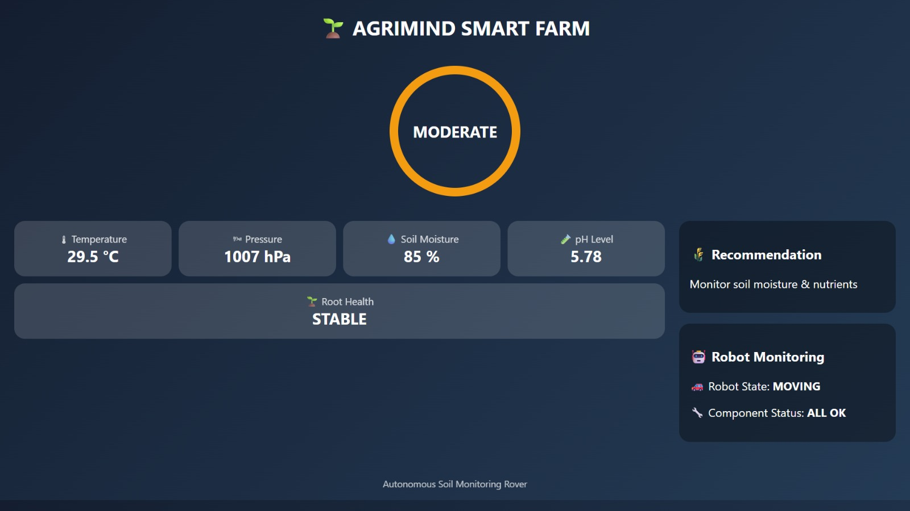
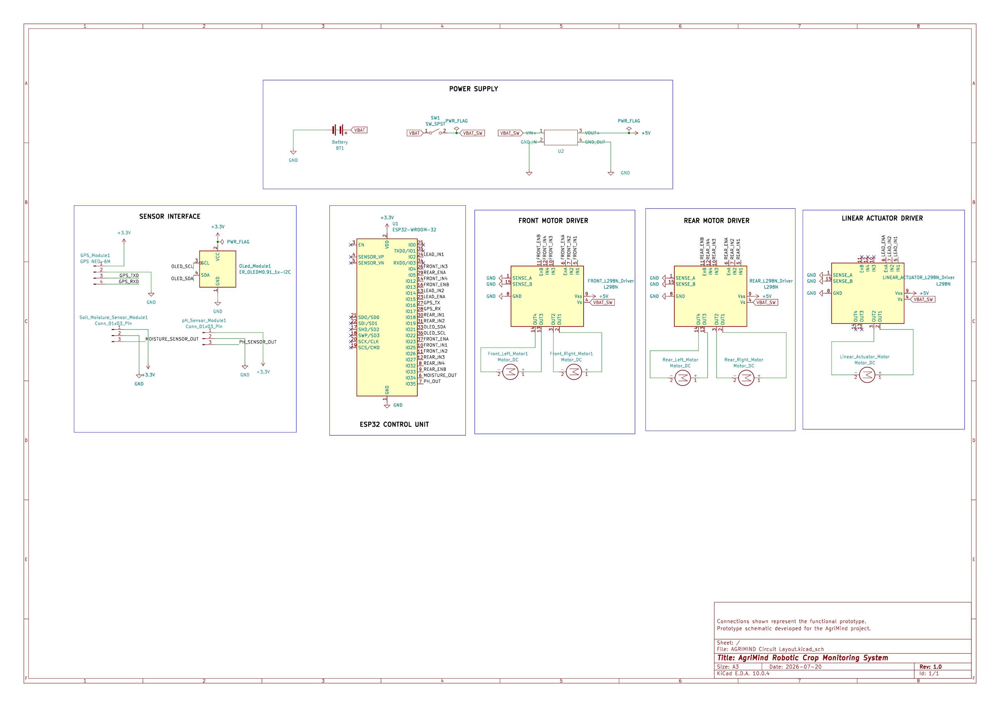

# 🌱 AgriMind – IoT-Based Robotic Crop Monitoring System

An IoT-based agricultural rover designed to monitor soil health by measuring moisture, pH, environmental conditions, and GPS location. The system uses an ESP32 controller, automated probe mechanism, and a Wi-Fi dashboard to assist precision farming.

## Overview

AgriMind is an IoT-based robotic crop monitoring system developed to assist precision agriculture by collecting real-time soil and environmental data.

The prototype integrates an ESP32 microcontroller, multiple soil sensors, GPS, a motorized probe mechanism, and a Wi-Fi dashboard to monitor field conditions and support irrigation decisions.

## Features

- Real-time soil moisture monitoring
- Soil pH measurement
- Temperature and pressure sensing
- GPS-based location tracking
- Automated probe insertion mechanism
- Wi-Fi dashboard
- ESP32-based embedded controller
- Mobile robotic platform

## System Workflow


## Hardware Components

| Component | Purpose |
|----------|---------|
| ESP32 | Main Controller |
| Soil Moisture Sensor | Moisture Measurement |
| Soil pH Sensor | pH Measurement |
| BMP280 | Temperature & Pressure |
| GPS Module | Location Tracking |
| OLED Display | Local Display |
| L298N Motor Driver | Motor Control |
| DC Motors | Rover Movement |
| Linear Actuator | Probe Mechanism |

## Software Stack

- Arduino IDE
- C++
- ESP32 Framework
- Wi-Fi
- TinyGPS++
- HTML Dashboard
- KiCad

## Repository Structure

```text
docs/
firmware/
hardware/
images/
resources/
software/
testing/
videos/
```

## Gallery

### Prototype


### Dashboard




### System Schematic



## Demonstration

Project demonstration videos are available in the `videos` directory.

## Documentation

Technical documentation is available in the `docs` directory.

- System Architecture
- Hardware Overview
- Software Overview
- Communication
- Testing Plan

## Patent

This project is associated with a published Indian Patent.

**Title:** Root-zone Bio-sensor and Mobile Field Monitoring System for Paddy Cultivation

**Publication Number:** IN202641024913 A1

**Status:** Published

## Future Improvements

- Cloud database integration
- Mobile application
- AI-based crop disease prediction
- Solar-powered charging
- Autonomous path planning

## License

This project is licensed under the MIT License.

## Author

**Venkatesan V**

Electronics and Communication Engineering

SRM Institute of Science and Technology